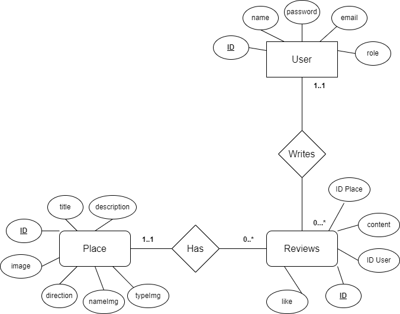
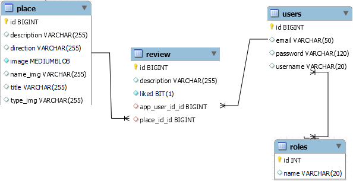
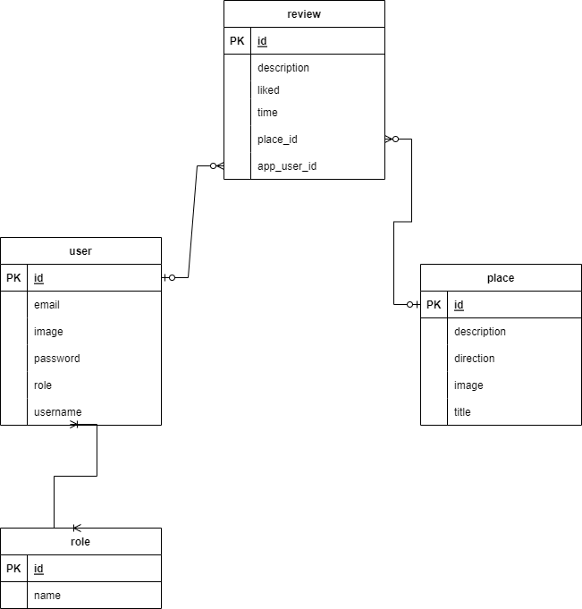
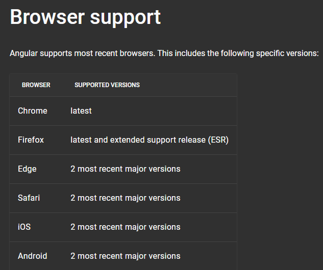
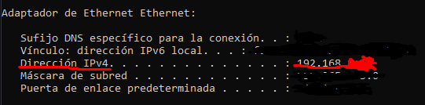
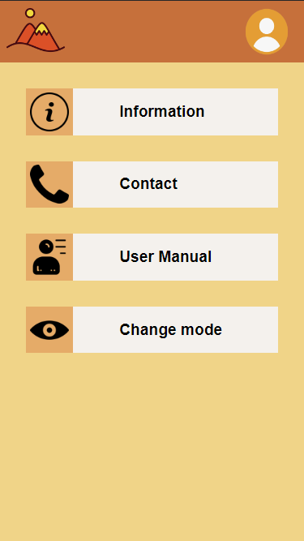
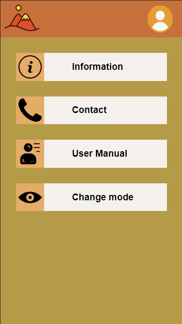
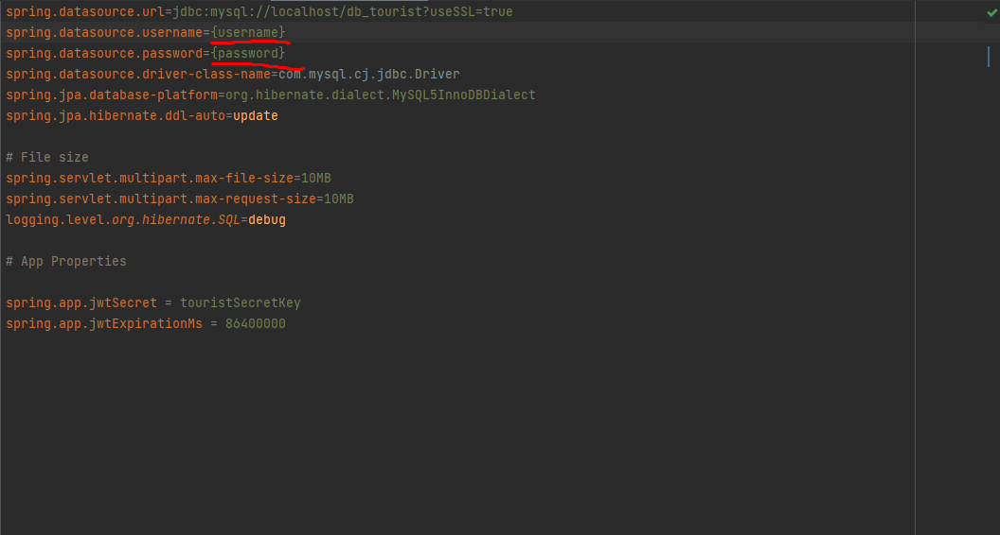

<h1 align="center">Tourist Places in the Canary Islands</h1>

<br/>

<div align="center">
    

  <h3 align="center">Tourist Places App</h3>

</div>

<details>
  <summary>Index</summary>
    <ol>

- [About this project](#About-this-project)
- [Data model](#data-model)
- [Requirements](#user-requirements)
- [Use Cases](#use-cases)
- [System operation and technical specifications](#description-of-system-operation-and-technical-specifications)
- [Interfaces](#interfaces)
  - [Start design](#start-design)
  - [Usability and accessibility](#usability-and-accessibility)
- [Manuals](#Manuals)
  - [Installation guide](#installation-guide)
- [Technology stack](#technology-stack)
- [Technology comparison](#technology-comparison)
- [Planification](#planification)
- [Conclusion](#conclusion)
- [Links and references](#links-and-references)
- [Author](#Author/s)

    </ol>
</details>

## About this project

### The reason behind it

This project was made in order to learn, inspired a lot on projects and interests from a company named OpenCanarias, in which I will be in to do a project, and OpenCanarias being an autochthonous company here from where I live (the canary islands) and their focus being on tourism and such, I decided to do something related with the place I live in, and with something related to tourism or hostelry. 

Thinking of an app to do, it crossed my mind the idea to do an app which you can use to see some of the most popular places in Canarias, to travel to when you are here as a tourist, for cases in which people come and want to discover places by themselves, or just want to know the most popular places in order to book trips to them.

This app was made to encourage tourism to the popular places here in the Canary Islands, but also to promote places that are not so well known that are also great for tourism.

The necessity this app covers is the already explained: there are places that are not so mainstream and people might miss, that are great for tourism and could benefit from some promotion, and might catch people's attention and make them more popular and active.

---

## Data model

The data model used in this project looks like this: 

 - [Entities and attributes](#entities-and-attributes)
 - [Relations between tables](#relationships-between-tables)
 - [Data model diagrams](#data-model-diagrams)

#### Entities and attributes



First I did the E/R diagram to have an idea on what the database should look like, which is the one you just saw, this helped me greatly on how the information should be treated and how the entities worked.

Although, the real database has 5 tables, that come from the authentication and overall security that was added, but the idea remained the same. Let's see in detail the attributes of each one:

+ Place:

  - ID: identification number of the place, NN (not null), AI (AutoIncremental) and PK (primary key).
  - Title: name of the place.
  - Description: brief description of the place.
  - Direction: where it is located.
  - Image: the blob of the image, NN.
  - NameImg: image name encoded.
  - TypeImg: type of the img: .png, .jpeg...

+ Review:

  - ID: identification number of each review, NN, AI and PK.
  - Description: content of the review (text).
  - Liked: bit (0 or 1) that is used as a boolean, to know if you liked the place or not. 1 is true, 0 is false, NN.
  - FK:placeId: identification number of the place which is related to (where this review is wrote), NN.
  - FK:userId: identification number of the user related to that review (who wrote it), NN.
  
+ User:

  - ID: identification number of the user, NN, AI and PK.
  - Username: name of the user.
  - Email: email of the user, can't be repeated, UQ (Unique).
  - Password: password of the user encrypted.

+ Roles:

  - ID: identification number of the role, NN, AI and PK.
  - Name: name of the role.

  The information in this table should be constant, as there is only two roles: admin and user.

+ User_Roles:

  - FK:userId: identification number of the user that has a certain role.
  - FK:roleId: identification number of the role that the user has.

For further research, the .sql file of the database is in the folder 'database' of this repository, it can be imported as it is, it has the two roles already wrote and all the other tables empty.

#### Relationships between tables

  - User-Review: One-to-Many relationship, one user can write more than 1 review.
  - Place-Review: One-to-Many relationship, one place can have more than 1 review.
  - User-Role: Many-to-Many relationship, many users can have many roles.

#### Data model diagrams

UML diagram:




Relational Diagram:



---

## User requirements


#### Platform:
- **P1**. This app was made for mobile phones, as the client wants this app for people to look places to go while on their mobile devices.

#### Access:
- **A1**. This app has a home screen where you can see the places and the reviews as a guest user, but nothing else.
- **A2**. In order to write reviews you must be logged in, so that you can leave your opinion in a place.
- **A3**. As an administrator you can create places, update them or delete them, as well as delete reviews, and users.
  - **A3.1**. As an administrator you can create, update or delete any of the places on your admin page.
  - **A3.2**. As an administrator you can also see all of the users.
- **A4**. As a user you can edit your profile, or write reviews.
  - **A4.1**. You can leave a positive review or negative review on any of the places.

#### Interfaces:

- **I1**. The application has three main interfaces: the places sit, your profile and the admin page.
- **I2**. In the first main interface, you can see a slider and places that the app is advertising, plus the log in icon to where you can go to register, look for help or login to access your private profile.
  - **I2.1**. You can go to any of the places to look up their information.
    - **I2.1.1**. You can see the description, location, title and image of the place you tapped on.
    - **I2.1.2**. You can also see reviews of the same place.
  - **I2.2**. You can log in by tapping the profile icon, or register going to another form.
    - **I2.2.1**. You will be able to login and access the profile interface by putting in your credentials.
    - **I2.2.2**. You will be able to register by tapping the register text and filling the form with your credentials.
    - **I2.2.3**. Or you can look for help by tapping the help icon, accessing the help page.
      - **I2.2.3.1**. In here you can see 3 cards: contact, information and user manual.
        - **I2.2.3.1.1**. the contact card will send you to a form so you can communicate any problem.
        - **I2.2.3.1.2**. the information about the app is displayed here.
        - **I2.2.3.1.3**. the user manual should be here.
- **I3**. As a user you will be able to do more actions.
  - **I3.1**. You will be able to change your profile in the private area.
  - **I3.2**. You will be able to see your reviews.
  - **I3.3**. You will be able to write reviews on places.
  - **I3.4**. You will be able to log out.
- **I4**. As a administrator, you will be able to list the places and users of the whole app.
  - **I4.1**. You will be able to delete any of the users, except yourself, the admin.
  - **I4.2**. You will be able to create places.
  - **I4.3**. You will be able to edit places.
  - **I4.4**. You will be able to delete places.
  - **I4.5**. You will be able to delete reviews in the places page.
   

#### Actions:

- **A1**. User actions will be accompanied by alerts or confirmation dialogs to give feedback as to what the user is doing.
- **A2**. The forms are completely validated, you can't send any wrong data to the database, and in case you fail your credentials you will be warned about it.

#### Validations:

- **V1**. You can't type things or send wrong data due to validation, making it impossible for the user to mess up due to the form not sending until you write those inputs correctly.
- **V2**. For the emails you can't write anything that's not a legal email, as it is controlled by a pattern.

---

## Use cases

The use case diagram is a simple one, in which we can see 3 actors, the guest, the user (a logged in user that has the default role, user) and the administrator (a logged user that has the administrator role)


---

## Description of system operation and technical specifications

### Technical specifications

To use this application your computer must at least, have the next requiremets:

  - Free Storage: 1GB.

  - RAM memory: 4GB.

  - S.O.: Windows 10.

  - CPU: Intel Core i3, AMD Ryzen 4 or similar.

  - Web browser: Google Chrome, Opera, Opera GX, Microsoft Edge, Firefox.



To see this application on your mobile device or tablet, you must execute:

  ```sh
  ng serve --host 0.0.0.0
  ```     

When you have done that step, you should find in the CMD your ip with the commmand 'ipconfig'.



When you have it, you should be in the same network and you should type in your web browser the following url:

* URL:
  ```sh
  http://{{Your IP}}:4200
  ```

Now, you should see the website on your device.

---

## Interfaces

#### Start design

You can see the prototype design in this url: https://www.figma.com/file/X9gz83hUXMTJyVjlDfyEr5/Tourist-Places?node-id=43%3A524&t=4FEeVvN7Z2bEZNGq-1

#### Usability and accessibility

##### Usability:

When it comes to usability, I took account of the user experience and made it as easy to use and intuitive as possible, I'm talking about:

  - Easy to learn desing, really simple and even similar to a lot of apps we are accustomed to, really easy to use at all times.

  - Feedback to the user via navigation, alerting about errors or actions done...

  - An interface that does not really change much from page to page, making it so when you know how to use the main components you know almost how to use the whole app.

 - Variety of actions really well differentiated, apart from also a customizable design with the switching of modes.

  - An interface done for the comfort of the user, making it easy for the user to navigate or scroll using only one hand, in this case it was done thinking of right hand dominant users, so they can use that hand alone to do most of the things in the app.


Not only the user comfort has been taken into account, but also the intuitive design which is accompanied by the use of contrast in colors, in which the most striking colors which catch the attention of the user are used so the user can differentiate from the navigation bar to a component of a place for example. This color palette was also chosen because of the theme that the app is based, in this case a tropical island in a fun to use app (the color palette can be seen on my figma).

The app can also vary from a light mode, to a darker mode with less striking colors. This was made for a customizable experience, in which you can decide how to see this app for different people with different likings or for those who don't like colors that are so striking to the eye.


#### Light Mode:



#### Dark Mode:



#####  Accessibility 

Regarding accessibility, I tried to make it so the app could be used by a vast majority of people, from teens who are likely to know how this type of apps work, to the elders who may not have used an app like this before, as the target audience of this app can vary from one to the another.
 
 - There's a contrast always present from the text to it's background, making it easy to read for most people and not have difficulties while seeing things in the app.

 - The users can look up how to use this app, so when they are in need of help they can look what to do.

 - The inputs on the forms are really easy to see and differentiate, making it easy for people to know that's where you write.

---

## Manuals

### Installation guide

#### Requirements

- Eclipse IDE or IntelliJ IDEA.
- MySQL Workbench.
- PostMan, for RESTFul tests.
- Visual Studio Code or similar.
- npm.

#### Get started 

##### Frontend

[![Angular][angular.io]][angular.url]

To get this project, you only need to clone it in your computer. You can open your Visual Studio or similar, open a new terminal wherever you want to store it, and with git bash clone this project opening the terminal and putting this command:

* clone this project:
    ```sh
    git clone https://github.com/SergioManuelJob/TouristProject.git
    ```

Then go to the frontend folder by using:

* routing:
    ```sh
    cd frontend/
    ```
 
 And install all of the project dependencies using npm:

* npm command:
    ```sh
    npm install
    ```

When all of this has been completed, you can configure the backend.

##### Backend

[![Spring][spring.io]][spring.url]

Go to MySQL workbench, and import the self contained file .sql from the database folder of this project, so you can get all the tables and the connection to the backend can be done correctly. (Do NOT erase anything from the roles table in the database, it is needed in the project.)

Open the backend folder with any IDE of your preference, and edit the application.properties file in the resources folder to match your database credentials.



With all of these done, you can start your backend with the IDE you have chosen. And once the server is running, start your frontend and enjoy the project.

* Run your frontend
    ```sh
    cd frontend/

    ng serve -o
    ```

---

## Technology stack

The tecnology stack used for this project was:

[![Angular][angular2.io]][angular.url]  for the Frontend.

[![Spring][spring2.io]][spring.url]  with Hibernate and Java, for the Backend.

---

## Technology comparison

Frontend: 

React and Angular comparison:

React and Angular are two of the most popular frontend right now, Angular is maintained by Google, while react is maintained by Facebook. Both have the same philosophy of working with components and making things reusable, but they are pretty different when working with them, because one is a whole framework, while the other is a library.

  - Angular as React is a web technology, which is great for making apps online as a web browser. This can be good for my project as you can access this app freely from anywhere, and as it doesn't really require anything from the plataform is used in, a native app wouldn't be suitable, an hybrid app though, can be a little bit more useful, but a web app for my purpose is still superior. Although, one thing that is better can be a PWA app, as it maintains data from your session and lets you see for example the places you saved in your cache, or your profile without access to the internet on the contrary to a full web app.

  - Angular brings more functions to the table, such as model, view and control separated, while react has a virtual DOM, a simpler interface and react native for mobile applications.

  - The syntax is also different, where Angular is based completely in Typescript, and React uses JSX making it easier for the users.

  - React as it is only a library is lighter than Angular, and is better in that case for smaller apps.

  - Angular for the frontend as it is a whole framework can work fine without the use of extensions most of the time, while React may need from the start many extensions in order to do many things, which is not a problem thanks to the communities they have both on their back developing things, but may be a problem for people who do not know of this extensions.

Backend: 

Node JS and Spring boot comparison:

Both technologies are ORMs used for the connection between the backend and the frontend. Therefore, it seems appropriate to compare them. So, let's list the differences:

Both of these are technologies used for backend programming, and while work with Java language and the other with Javascript mostly, both are really good.

  - Node JS can work on more than one task using one thread, thanks to asynchronous functions.

  - Spring can be easily executed, thanks to the annotations and dependencies behind, making the configuration much easier, as it is auto configurated. 

  - Spring is multi thread, and this is great for really long operations or repetitive ones, as it uses a lot of threads silmutaneosly (this makes more use of your memory though).

  - Creation of microservices is also easier in Spring boot thanks to new independent services.

---

## Planification

The planification of this project was done thanks to github projects and issues features, which I used to divide my tasks to do things more especifically rather that all at once, finishing things bit by bit.

I started this project as all people should, having an idea. This idea was later translated into the entities and tables, which were made into diagrams and attributes, to have a better idea of how the whole project would turn and what I should do to make it functional; once finished with the ideation of the app, I started designing it, doing a prototype in Figma to clear out my mind on how I would treat things in the backend to implement it correctly in the frontend.

Once all that process was done, I started by doing the backend, where I created all of the CRUDs, created a way to authenticate and have security, made roles so the diagrams I created could correspond with the project itself... Once I almost got all the backend sorted, I started doing the skeleton of the app, designing it completely but without any real functionality, just doing styles and components for when I could get the entities from the backend.

Then I finished the backend almost completely, and started adding functionality to the frontend, making calls and doings requests of all sort, until I finally did it completely and finished the project.

Once all of this was finished, I wrote this documentation you are seeing right now, and that was all of the work done.

To view all of the tasks that I made myself in order to make this project, you can go to the projects section of this repository, where all the issues are, to know how I confronted this.

---

## Conclusion

My conclusion to this first whole project is that I've learned a lot, not only about programming a whole fullstack app, which I'm proud of even when it's probably not perfect, but about myself and working in something constantly for a lot of time. I've learned to not see progress in a lot of days and not be desperate, as it is a project that takes what it takes to make (a lot of time and effort in this case, and sleepless nights searching for solutions); to organize myself in a long period of time, in which I must admit that I did horribly as the work should've been more spread out, this is something I must work on and it is now, after finishing this whole project, that I understand why people insisted to work everyday, even if it's a bit and it's only looking up things, but at least a bit so you can be more relaxed the last few days and not crunch yourself in order to finish the project; to let things flow, sometimes I encountered problems that seemed impossible to solve for me, and stopped right there at the time blocked at the idea that I couldn't do it, only to realize when talking to someone that I'm capable of fixing not only that but much more, and that I sometimes overcomplicate things; and much, much more, this was a really long project and I would also dare to call it a stage of my life, as it was a self discovering experience.

In hindsight this was an overall positive and great experience, which I'm grateful to have done this early in my life, and that has taught me a lot and made me realize what I need to change and solve, weak links about myself and also, because not everything is bad, strong links that have helped me overcome a lot of problems facing this project. There was a lot of learning that I had to do, a lot of things which I'm amazed I can even understand today, but not only that make... And here I am, with a project I can be happy with as it took me a lot of effort.

---

## Links and references

  - [Bezkoder repository][bezkoderRepository.url]

  - [Dark mode dependency][darkModeDependency.url]

  - [Angular Material][angularMaterial]

  - [NgxPermissions Dependency][ngxPermissions]

  - [![Postman][postman.io]][postman.url]

---

## Author

Sergio Manuel Suárez Suárez: https://github.com/SergioManuelJob

---

<!-- MARKDOWN LINKS AND IMAGES -->

[bezkoderRepository.url]: https://github.com/bezkoder/angular-11-spring-boot-jwt-authentication
[darkModeDependency.url]: https://www.npmjs.com/package/angular-dark-mode
[Postman.io]: https://img.shields.io/badge/POSTMAN%20Documentation-orange?style=for-the-badge&logo=postman&logoColor=black
[postman.url]: https://documenter.getpostman.com/view/23431388/2s8YzZNeDY
[angularMaterial]: https://material.angular.io
[ngxPermissions]: https://www.npmjs.com/package/ngx-permissions

[angular2.io]: https://img.shields.io/badge/Angular-red?style=for-the-badge&logo=angular&logoColor=black
[angular.url]: https://angular.io

[spring2.io]: https://img.shields.io/badge/Spring-green?style=for-the-badge&logo=spring&logoColor=black
[spring.url]: https://spring.io
