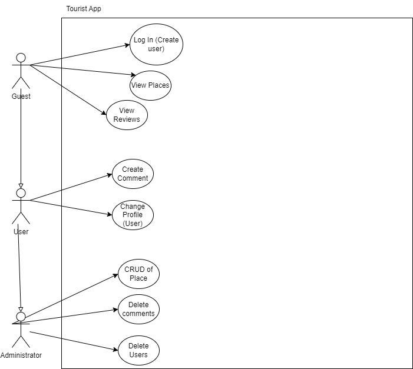

<h1 align="center">Tourist Places in the Canary Islands</h1>

<br/>

<div align="center">
    

  <h3 align="center">Tourist Places App</h3>

</div>

<details>
  <summary>Index</summary>
    <ol>

- [About this project](#About-this-project)
- [Data model](#data-model)
- [Requirements](#user-requirements)
- [Use Cases](#use-cases)
- [System operation and technical specifications](#description-of-system-operation-and-technical-specifications)
- [Interfaces](#interfaces)
  - [Start design](#start-design)
  - [Usability and accessibility](#usability-and-accessibility)
- [Manuals](#Manuals)
  - [Installation guide](#installation-guide)
- [Technology stack](#technology-stack)
- [Technology comparison](#technology-comparison)
- [Planification](#planification)
- [Conclusion](#conclusion)
- [Links and references](#links-and-references)
- [Author](#Author/s)

    </ol>
</details>

## About this project

### The reason behind it

This project was made in order to learn, inspired a lot on projects and interests from a company named OpenCanarias, in which I will be in to do a project, and OpenCanarias being an autochthonous company here from where I live (the canary islands) and their focus being on tourism and such, I decided to do something related with the place I live in, and with something related to tourism or hostelry. 

Thinking of an app to do, it crossed my mind the idea to do an app which you can use to see some of the most popular places in Canarias, to travel to when you are here as a tourist, for cases in which people come and want to discover places by themselves, or just want to know the most popular places in order to book trips to them.

This app was made to encourage tourism to the popular places here in the Canary Islands, but also to promote places that are not so well known that are also great for tourism.

The necessity this app covers is the already explained: there are places that are not so mainstream and people might miss, that are great for tourism and could benefit from some promotion, and might catch people's attention and make them more popular and active.

---

## Data model

The data model used in this project looks like this: 

 - [Entities and attributes](#entities-and-attributes)
 - [Relations between tables](#relationships-between-tables)
 - [Data model diagrams](#data-model-diagrams)

#### Entities and attributes


First I did the E/R diagram to have an idea on what the database should look like, which is the one you just saw, this helped me greatly on how the information should be treated and how the entities worked.

Although, the real database has 5 tables, that come from the authentication and overall security that was added, but the idea remained the same. Let's see in detail the attributes of each one:

+ Place:

  - ID: identification number of the place, NN (not null), AI (AutoIncremental) and PK (primary key).
  - Title: name of the place.
  - Description: brief description of the place.
  - Direction: where it is located.
  - Image: the blob of the image, NN.
  - NameImg: image name encoded.
  - TypeImg: type of the img: .png, .jpeg...

+ Review:

  - ID: identification number of each review, NN, AI and PK.
  - Description: content of the review (text).
  - Liked: bit (0 or 1) that is used as a boolean, to know if you liked the place or not. 1 is true, 0 is false, NN.
  - FK:placeId: identification number of the place which is related to (where this review is wrote), NN.
  - FK:userId: identification number of the user related to that review (who wrote it), NN.
  
+ User:

  - ID: identification number of the user, NN, AI and PK.
  - Username: name of the user.
  - Email: email of the user, can't be repeated, UQ (Unique).
  - Password: password of the user encrypted.

+ Roles:

  - ID: identification number of the role, NN, AI and PK.
  - Name: name of the role.

  The information in this table should be constant, as there is only two roles: admin and user.

+ User_Roles:

  - FK:userId: identification number of the user that has a certain role.
  - FK:roleId: identification number of the role that the user has.

For further research, the .sql file of the database is in the folder 'database' of this repository, it can be imported as it is, it has the two roles already wrote and all the other tables empty.

#### Relationships between tables

  - User-Review: One-to-Many relationship, one user can write more than 1 review.
  - Place-Review: One-to-Many relationship, one place can have more than 1 review.
  - User-Role: Many-to-Many relationship, many users can have many roles.

#### Data model diagrams

UML diagram:


Relational Diagram:


---

## User requirements

#### Platform:
- **P1**. This application comes as a website that you can use wherever you want.
- **P2**. You can use it on mobile devices or tablets because it is a responsive application.

#### Access:
- **A1**. The app has a guest screen that can be accessed without being logged in.
- **A2**. To make reservations you must be registered as a user, an administrator will check that everything is correct.
- **A3**. As an administrator you can create, edit or delete data.
  - **A3.1**. As an administrator you can create, update or delete an apartment.
  - **A3.2**. As an administrator you can check all reservations of users.
- **A4**. As a user you can edit your reservation.
  - **A4.1**. As a user you can book an apartment and modify it if the start date does not match today's date.
  - **A4.2**. As a user you can delete your reservation when it is finished.

#### Interfaces:

- **I1**. The application has two main interface where you can see all types of apartments.
- **I2**. In the first main interface, you can navigate between help, login or apartment details and there is slider.
  - **I2.1**. In the help interface, you will find cards with some places to go.
    - **I2.1.1**. The first card you will find is the terms and privacy policy.
    - **I2.1.2**. The second card you will fin is the application information.
    - **I2.1.3**. The third card you will find is the additional information.
    - **I2.1.4**. The fourth card you will find is the contact.
  - **I2.2**. You will find a form and some actions in login interface.
    - **I2.2.1**. You will be able to login to these interfaces by filling in the form with your account data.
    - **I2.2.2**. You will be able to register if you do not have an account by clicking on a button.
    - **I2.2.3**. You will be able to recover your password if you do not remember it.
- **I3**. As a user you will be able to find more options than before.
  - **I3.1**. In the help interface, you will find a card to delete your account.
  - **I3.2**. You will be able to book an apartment.
  - **I3.3**. You will be able to see all the reservations you have made.
    - **I3.3.1**. You will be able to delete or edit your reservations depending on whether you have your reservation that day or not.
  - **I3.4**. You will be able to log out.
- **I4**. As a administrator, you will be able to see the second main interface.
  - **I4.1**. You will be able to add new types of apartments.
  - **I4.2**. You will be able to edit or delete existing apartment types.
  - **I4.3**. You will be able to see all the reservations of all users.
    -**I4.3.1**. You will be able to delete user reservations.

#### Actions:

- **A1**. User actions will be accompanied by comments and notifications when they are performed.
- **A2**. When entering data in the form, it is validated that the information is entered correctly, notifying the user if there is an error.

#### Validations:

- **V1**. When typing or adding data, if an error occurs with respect to any character, you will be warned and the desired action will not be allowed.
- **V2**. There are more than one type of validations, such as when you do not have the required credentials or the date is incorrect.
  - **V2.1**. When you book an apartment, you cannot choose dates less than the current date at that time.
- **V3**. When you enter your email address to log in or register, we will apply a mask to see if it is a valid email address.

---

## Use cases

The use case diagram is a simple one, in which we can see 3 actors, the guest, the user (a logged in user that has the default role, user) and the administrator (a logged user that has the administrator role)



---

## Description of system operation and technical specifications

### Technical specifications

To use this application your computer must at least, have the next requiremets:

  - Free Storage: 1GB.

  - RAM memory: 4GB.

  - S.O.: Windows 10.

  - CPU: Intel Core i3, AMD Ryzen 4 or similar.

  - Web browser: Google Chrome, Opera, Opera GX, Microsoft Edge, Firefox.


To see this application on your mobile device or tablet, you must execute:

  ```sh
  ng serve --host 0.0.0.0
  ```     

When you have done that step, you should find in the CMD your ip with the commmand 'ipconfig'.


When you have it, you should be in the same network and you should type in your web browser the following url:

* URL:
  ```sh
  http://{{Your IP}}:4200
  ```

Now, you should see the website on your device.

---

## Interfaces

#### Start design

You can see the prototype design in this url: https://www.figma.com/file/X9gz83hUXMTJyVjlDfyEr5/Tourist-Places?node-id=43%3A524&t=4FEeVvN7Z2bEZNGq-1

#### Usability and accessibility

##### Usability:

When it comes to usability, I took account of the user experience and made it as easy to use and intuitive as possible, I'm talking about:

  - Easy to learn desing, really simple and even similar to a lot of apps we are accustomed to, really easy to use at all times.

  - Feedback to the user via navigation, alerting about errors or actions done...

  - An interface that does not really change much from page to page, making it so when you know how to use the main components you know almost how to use the whole app.

 - Variety of actions really well differentiated, apart from also a customizable design with the switching of modes.

  - An interface done for the comfort of the user, making it easy for the user to navigate or scroll using only one hand, in this case it was done thinking of right hand dominant users, so they can use that hand alone to do most of the things in the app.


Not only the user comfort has been taken into account, but also the intuitive design which is accompanied by the use of contrast in colors, in which the most striking colors which catch the attention of the user are used so the user can differentiate from the navigation bar to a component of a place for example. This color palette was also chosen because of the theme that the app is based, in this case a tropical island in a fun to use app (the color palette can be seen on my figma).

The app can also vary from a light mode, to a darker mode with less striking colors. This was made for a customizable experience, in which you can decide how to see this app for different people with different likings or for those who don't like colors that are so striking to the eye.


#### Light Mode:


#### Dark Mode:


#####  Accessibility 

Regarding accessibility, I tried to make it so the app could be used by a vast majority of people, from teens who are likely to know how this type of apps work, to the elders who may not have used an app like this before, as the target audience of this app can vary from one to the another.
 
 - There's a contrast always present from the text to it's background, making it easy to read for most people and not have difficulties while seeing things in the app.

 - The users can look up how to use this app, so when they are in need of help they can look what to do.

 - The inputs on the forms are really easy to see and differentiate, making it easy for people to know that's where you write.

---

## Manuals

### Installation guide

#### Requirements

- Eclipse IDE or IntelliJ IDEA.
- MySQL Workbench.
- PostMan, for RESTFul tests.
- Visual Studio Code or similar.

#### Get started 

##### Frontend

[![Angular][angular.io]][angular.url]

To get started, create an empty folder on your computer and open your Visual Studio Code.

Once open, go to Files > Open Folder > and select the folder you just created.

Now, open a terminal in the new folder.

![newTerminal][newTerminal.img]

Once you are in the terminal of your folder execute the following commands:

* clone repository
    ```sh
    git clone https://github.com/JordanJTY/hotelWeb_Angular-Spring
    ```

Install all project's dependencies (Patience! It may take a few minutes):
 
* npm
    ```sh
    npm install
    ```

When dependencies have been installed, you can go to set up your backend.

##### Backend

[![Spring][spring.io]][spring.url]

To get started, open the backend of the project with the IDE of your choice. In my case, I used IntelliJ.

![openedIDE][openedIDE.img]

Once you have the backend open, go to MYSQL Workbench and check your username and password to access in your IDE. Also, take advantage of this opportunity to import a database where you save your data:

![createDB][createDB.img]

Once these steps are done, you can start your backend without first configuring your application properties with your database name and MySQL password.

![changeBackendConfiguration][changeBackendConfiguration.img]

Remember start your frontend!

* Run your frontend
    ```sh
    cd frontend/

    ng serve -o
    ```

---

## Technology stack

To carry out this project, I used a technology stack consisting of:

[![Angular][angular2.io]][angular.url] used as Frontend.

[![Spring][spring2.io]][spring.url] with Hibernate and Java, used as Backend.

---

## Technology comparison

To compare technologies, I will choose those that I have had the opportunity to test or see from my peers. In this case I have chosen the following:

Frontend: 

[![React][react.io]][react.url] to compare with [![Angular][angular.io]][angular.url]

Both are constituted by the use of components, therefore, they are a good example to compare. However, while React uses JavaScript, Angular uses TypeScript. The difference between the two tools is that React is a JavaScript library and Angular is a framework designed for the frontend. With the basics clarified, let's list the differences:

  - React uses one-way data binding and virtual DOM, whereas Angular uses two-way data binding and real DOM.

  - React is faster than Angular as it has a smaller bundle size.

  - React is mostly used to build interactive UI components with frequently variable data, whereas Angular.js is used to build complex enterprise apps like progressive web apps and single-page apps.

  - Angular JS is used to build single-page applications using HTML and TypeScript. React JS is commonly used to create user interfaces for single-page applications from isolated components.

  - Angular is a part of the MEAN stack and is very compatible with many code editors. It’s also considered to develop dynamic websites and web apps. On the other hand, React is widely used to develop reusable HTML elements for front end development.

Backend: 

[![Sequelize][sequelize.io]][sequelize.url] to compare with [![Spring][spring.io]][spring.url]

Both technologies are ORMs used for the connection between the backend and the frontend. Therefore, it seems appropriate to compare them. So, let's list the differences:

  - Sequelize is a simpler development tool than Spring with respect to application development.

  - Spring and sequelize focus on creating a backend for frameworks such as frontends, having similar power in their uses. 

  - Spring allows us to work with MVC frameworks with PHP, being the better of the two ORMs in this aspect.

  - Sequelize allows us to perform powerful works in Digital Drawing and Painting environments.

---

## Planification

To organize myself during the development of this project, I have established pending objectives to be done from the beginning, proposing to do them as I finished the ideation of the application.

The first thing I did after establishing the idea of creating the website of a hotel, was to start developing the diagrams of the database and its relationships, as well as its attributes. Once decided, I created a project in GitHub that allowed me to keep a version control and, in turn, a control of the pending tasks I had. Once the tasks were set, create a mockup of the interfaces of my application, to have a reference as soon as I started to develop them with Angular. After finalizing the prototype, I prioritized the development of a stable and complete backend that would allow me to make a CRUD of all the tables and be able to "forget" about it once the frontend was ready.
After the completion of the backend, along with its authentication and its respective tests with Postman, I proceeded with the frontend, taking as a reference my mockup made in Figma, but not before creating the corresponding services and models for a good connection to the database.

When I finished the project, I started to write the project documentation, including the different manuals for future users.

You can see the control of pending tasks in the link of this project, navigating to the "project" section. However, I'll leave the link here for you to go from now on. 
 - [![ControlTasks][controlTasks.io]][controlTasks.url]

---

## Conclusion

My conclusion to this first whole project is that I've learned a lot, not only about programming a whole fullstack app, which I'm proud of even when it's probably not perfect, but about myself and working in something constantly for a lot of time. I've learned to not see progress in a lot of days and not be desperate, as it is a project that takes what it takes to make (a lot of time and effort in this case, and sleepless nights searching for solutions); to organize myself in a long period of time, in which I must admit that I did horribly as the work should've been more spread out, this is something I must work on and it is now, after finishing this whole project, that I understand why people insisted to work everyday, even if it's a bit and it's only looking up things, but at least a bit so you can be more relaxed the last few days and not crunch yourself in order to finish the project; to let things flow, sometimes I encountered problems that seemed impossible to solve for me, and stopped right there at the time blocked at the idea that I couldn't do it, only to realize when talking to someone that I'm capable of fixing not only that but much more, and that I sometimes overcomplicate things; and much, much more, this was a really long project and I would also dare to call it a stage of my life, as it was a self discovering experience.

In hindsight this was an overall positive and great experience, which I'm grateful to have done this early in my life, and that has taught me a lot and made me realize what I need to change and solve, weak links about myself and also, because not everything is bad, strong links that have helped me overcome a lot of problems facing this project. There was a lot of learning that I had to do, a lot of things which I'm amazed I can even understand today, but not only that make... And here I am, with a project I can be happy with as it took me a lot of effort.

---

## Links and references

  - [Bezkoder repository][bezkoderRepository.url]

  - [Dark mode dependency][darkModeDependency.url]

  - [Angular Material][angularMaterial]

  - [NgxPermissions Dependency][ngxPermissions]

  - [![Postman][postman.io]][postman.url]

---

## Author

Sergio Manuel Suárez Suárez: https://github.com/SergioManuelJob

---

<!-- MARKDOWN LINKS AND IMAGES -->

[bezkoderRepository.url]: https://github.com/bezkoder/angular-11-spring-boot-jwt-authentication
[darkModeDependency.url]: https://www.npmjs.com/package/angular-dark-mode
[Postman.io]: https://img.shields.io/badge/POSTMAN%20Documentation-orange?style=for-the-badge&logo=postman&logoColor=black
[postman.url]: https://documenter.getpostman.com/view/23431388/2s8YzZNeDY
[angularMaterial]: https://material.angular.io
[ngxPermissions]: https://www.npmjs.com/package/ngx-permissions

[angular2.io]: https://img.shields.io/badge/Angular-red?style=for-the-badge&logo=angular&logoColor=black
[angular.io]: https://img.shields.io/badge/Frontend-Angular-red?style=flat-square&logo=angular&logoColor=red
[angular.url]: https://angular.io

[react.io]: https://img.shields.io/badge/Frontend-React-aqua?style=flat-square&logo=React&logoColor=aqua
[react.url]: https://reactjs.org

[spring2.io]: https://img.shields.io/badge/Spring-green?style=for-the-badge&logo=spring&logoColor=black
[spring.io]: https://img.shields.io/badge/Backend-Spring-green?style=flat-square&logo=spring&logoColor=green
[spring.url]: https://spring.io

[sequelize.io]: https://img.shields.io/badge/Backend-Sequelize-blue?style=flat-square&logo=Sequelize&logoColor=blue
[sequelize.url]: https://sequelize.org
